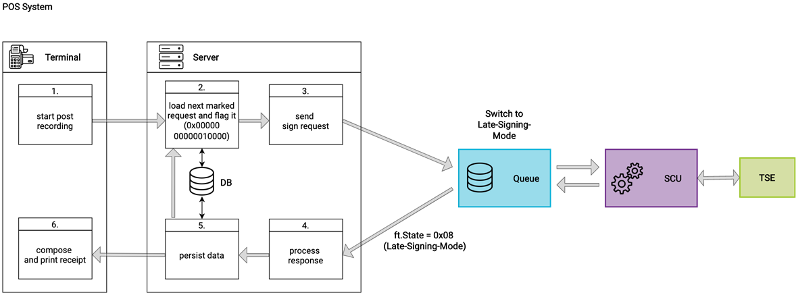
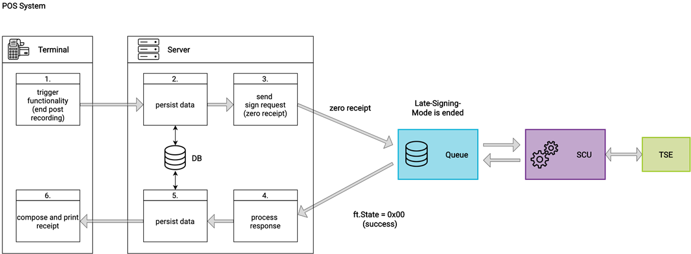

### Failure Scenarios
This Chapter describes the different scenarios of failure when using the fiskaltrust.Middleware.

#### Failure of the fiskaltrust.Middleware
If a cash register cannot communicate with the fiskaltrust.Middleware it is most likely due to a failure of the fiskaltrust Middleware. Such a failure means that the electronic recording system is not operational and there is no access to the appropriate journal.

In this case, the following steps must be taken:

  - The cash register or input station must automatically produce a receipt and its copy.
  - The receipt must be marked with the identification "electronic recording system failed" and with the current failure counter.
  - This copy needs to be kept until the failure is resolved. The creation and storing of the receipt copy can also be done electronically by the cash register or terminal.
  - After re-establishing the communication to fiskaltrust.Middleware, the cash register or the input station must send all receipts marked with the identification "receipt copy, electronic recording system failed" to fiskaltrust.Middleware. The ReceiptCase must be flagged with the code "failed receipt" in order to indicate the failure to fiskaltrust.Middleware, which will then issue a receipt response with the identification "electronic recording system failed" for each receipt. 

An alternative way of handling such situation is the generation of a handwritten receipt. A carbon copy (or another copy, e.g. electronic copy) must be created and archived. After re-establishing communication with fikaltrust.Middleware, these copies are subsequently to be recorded as receipts. The receipt code has to be combined with the "failed receipt" code in order to notify fiskaltrust.Middleware of the failure.

After fiskaltrust.Middleware has received an "end of failure receipt", the status of failure is terminated by receiving a response with normal state code.

